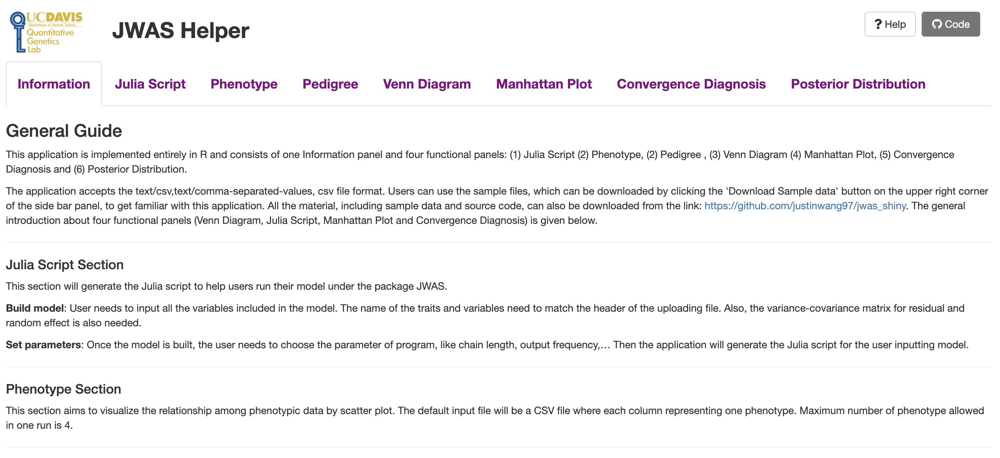

# Summary

ShinyJWAS is a shiny web application to help users to perform whole-genome Bayesian regression analysis with JWAS package ([@JWAS]), a well-documented software platform based on Julia and the interactive Jupyter notebook for analyses of general univariate and multivariate Bayesian mixed effects models.  With the easy-to-use graphical user interface (GUI) (Figure \autoref{shiny_image}), ShinyJWAS provides users a complete tutorial to the JWAS package for Bayesian analysis and a number of options to manage, explore, and visualize the data. The application provides interactive interfaces to generate scripts to run Bayesian analysis in JWAS, visualize phenotypic data, pedigree structure, and posterior distributions of parameters of interest, e.g., heritability, make Manhattan plot from GWAS, and perform convergence diagnosis of MCMC samples.

In conclusion, functions in ShinyJWAS free users from scripting by automating the Bayesian analysis process and provide interactive interfaces for data summarization, visualization, and diagnostic tests. More detailed documentation and tutorials can be found on the shiny app page: https://zigwang.shinyapps.io/shiny_app/.




#Acknowledgements

This work was supported by the United States Department of Agriculture, Agriculture and Food Research Initiative National Institute of Food and Agriculture Competitive grant no. 2018-67015-27957.


# Mathematics

Single dollars ($) are required for inline mathematics e.g. $f(x) = e^{\pi/x}$

Double dollars make self-standing equations:

$$\Theta(x) = \left\{\begin{array}{l}
0\textrm{ if } x < 0\cr
1\textrm{ else}
\end{array}\right.$$

You can also use plain \LaTeX for equations
\begin{equation}\label{eq:fourier}
\hat f(\omega) = \int_{-\infty}^{\infty} f(x) e^{i\omega x} dx
\end{equation}
and refer to \autoref{eq:fourier} from text.

# Citations

Citations to entries in paper.bib should be in
[rMarkdown](http://rmarkdown.rstudio.com/authoring_bibliographies_and_citations.html)
format.

If you want to cite a software repository URL (e.g. something on GitHub without a preferred
citation) then you can do it with the example BibTeX entry below for @fidgit.

For a quick reference, the following citation commands can be used:
- `@author:2001`  ->  "Author et al. (2001)"
- `[@author:2001]` -> "(Author et al., 2001)"
- `[@author1:2001; @author2:2001]` -> "(Author1 et al., 2001; Author2 et al., 2002)"

# Figures

Figures can be included like this:

and referenced from text using \autoref{fig:example}.

Fenced code blocks are rendered with syntax highlighting:
```python
for n in range(10):
    yield f(n)
```	

# Acknowledgements

We acknowledge contributions from Brigitta Sipocz, Syrtis Major, and Semyeong
Oh, and support from Kathryn Johnston during the genesis of this project.

# References